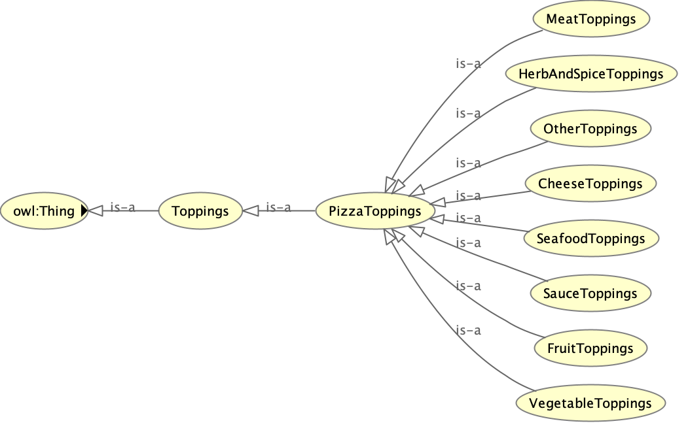
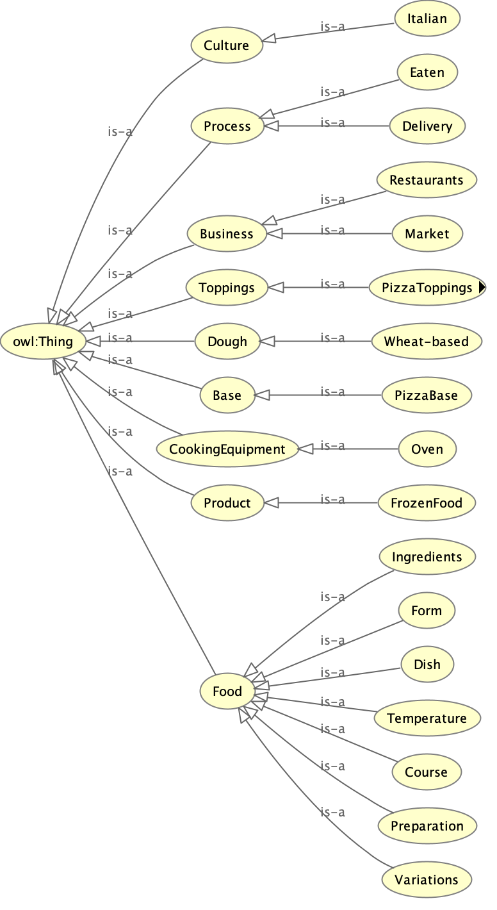

# Auto Ontology
The incorporation of Artificial Intelligence (AI) models into various optimization systems is on the rise. Yet, addressing complex urban and environmental management problems normally requires in-depth domain science and informatics expertise. This expertise is essential for deriving data and simulation-driven for informed decision support. In this context, we investigate the potential of leveraging the pre-trained Large Language Models (LLMs). These models carry exceptional understanding, reasoning, and generative abilities with human natural language to encode domain knowledge into scientific ontology, facilitating the development of the next-generation decision support systems for promoting smart city services. 
By adopting ChatGPT API as the reasoning core, we outline an integrated workflow that encompasses natural language processing, methontology-based prompt tuning, and transformers. This workflow automates the creation of scenario-based ontology using existing research articles and technical manuals of urban datasets and simulations. The outcomes of our methodology are knowledge graphs in widely adopted ontology languages (e.g., OWL, RDF, SPARQL). These facilitate the development of urban decision support systems by enhancing the data and metadata modeling, the integration of complex datasets, the coupling of multi-domain simulation models, and the formulation of decision-making metrics and workflow. The feasibility of our methodology is evaluated through a comparative analysis that juxtaposes our AI-generated ontology with the well-known Pizza Ontology employed in tutorials for popular ontology software (e.g., protégé). We close with a real-world case study of optimizing the complex urban system of multi-modal freight transportation by generating anthologies of various domain data and simulations to support informed decision-making.


<!-- python3 -m venv /home/pip install -U layoutparserjose/RECOIL_Auto_Onotology/.venv -->

# Installation Instructions
```
source Auto_Onotology/.venv/bin/activate

```


<!-- 
# PPT
```
https://liveutk.sharepoint.com/sites/ARPA-EProposal/Shared%20Documents/General/ORNL/Dr.Xu/RECOIL_AUTO_ONTO.pptx?web=1
``` -->


<!-- # Paper Collection

```

https://www.zotero.org/groups/5479511/auto_onto

``` -->


<!-- # GDrive

```

https://drive.google.com/drive/folders/1U7H-KN-kqNMRBfjr77V1KOPgXsqSJQWr?usp=sharing

``` -->

# Intial LLM GPT-4 Workflow
Please Execute:
```
RECOIL_Auto_Onotology/exec_gptapi_flow.sh
```

# Outputs
## Automated Ontology Outer Section

## Automated Ontology Inner Section



<!-- # New RAG + LLM Workflow

```
For further instructions please check:

 RECOIL_Auto_Onotology/LLMAuto/Readme.md

``` -->

